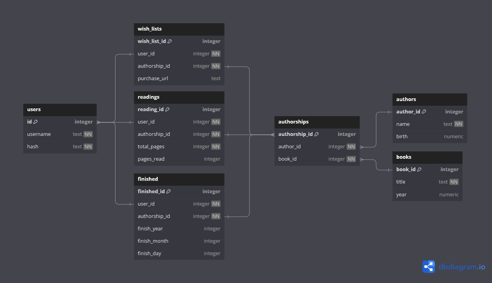

# PageFinder

### Video Demo:
[PageFinder Demonstration on YouTube](https://youtu.be/tuKbJ0SmAjI)

### Description:
PageFinder is a responsive web application created as the Final Project for Harvard's CS50x 2024 course. Developed using Python with Flask, HTML, CSS, and JavaScript with Bootstrap, and PostgreSQL, it allows users to manage their reading activities. Users can register and log in to their accounts, and add books to their "Reading List", "Wish List", or "Finished List". The platform provides an intuitive interface for tracking current reads, planning future books, and recording completed titles. Additionally, users contribute to the community-driven database by registering new books and authors, enhancing the collective resource for all users.

### Features:
- User registration and login
- Account settings
- Add books to "Reading List", "Wish List", and "Finished List"
- Track current reads, plan future books and log completed titles
- Community-driven database with user-contributed books and authors

### Reading list
In the "Readings" section, users can view all their ongoing reading activities. This section provides detailed information on each book, including the percentage completed and the last page read. Users can easily update their progress by entering the current page they are on. Additionally, they can access more detailed information about each book, enhancing their reading experience and helping them stay organized.

### Wish List
In the "Wish List" section, users can add books they wish to read or acquire. This section allows users to keep track of books they are interested in, along with the option to include a URL for purchasing the book. This feature helps users organize their future reading plans and provides a convenient way to remember where they want to buy each book.

### Finished list
In the "Finished" section, users can list books they've completed reading, along with the date of completion. This feature allows users to track their reading progress and reflect on their accomplishments.

### Adding Books
In the "Add Book" section, accessed by clicking the plus button in the bottom right corner of the screen, users can add books to any of their lists. If the book is not in the database, users have the option to register both a new book and a new author by clicking "Register a new book or author to our database." This feature provides users with flexibility to customize their reading lists and contribute to the expansion of the database.

### Languages and Tools:
- Python
- Flask
- HTML
- CSS
- JavaScript
- Bootstrap
- SQLite

### Database Schema

### Contributing:
Contributions are welcome! Please fork the repository and submit a pull request. For major changes, please open an issue first to discuss what you would like to change.

### License:
This project is licensed under the MIT License.
